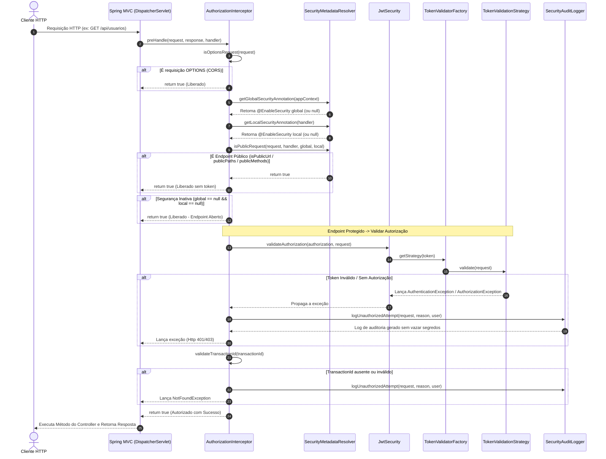
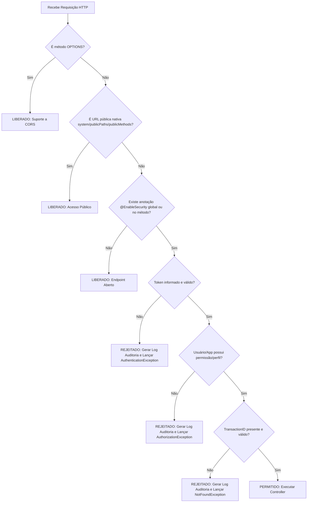

# Guia de Uso: `EnableSecurity`

Este guia documenta o funcionamento, os cenários de utilização e a arquitetura interna da anotação centralizadora de segurança `@EnableSecurity`.

---

## 1. Visão Geral da Anotação `@EnableSecurity`

A anotação `@EnableSecurity` substitui a necessidade de gerenciar múltiplos interceptores ou aspectos manuais de autorização. Ela pode atuar em dois níveis:

1. **Nível Global (Classe Principal da Aplicação ou `@Configuration`):** Ativa a segurança para **todos** os endpoints da aplicação.
2. **Nível Local (Controller ou HandlerMethod):** Ativa a segurança **exclusivamente** no endpoint ou controlador anotado, mantendo o restante da aplicação aberto.

---

## 2. Cenários Práticos de Uso

### Cenário 1: Proteção Global da Aplicação
Quando declarada na classe principal da aplicação (anotada com `@SpringBootApplication`), todos os endpoints exigirão autorização e token válido por padrão.

```java
package com.br.azevedo.demo;

import com.br.azevedo.security.EnableSecurity;
import org.springframework.boot.SpringApplication;
import org.springframework.boot.autoconfigure.SpringBootApplication;

@SpringBootApplication
@EnableSecurity
public class DemoApplication {
    public static void main(String[] args) {
        SpringApplication.run(DemoApplication.class, args);
    }
}
```
> **Comportamento:** Todos os Controllers e endpoints da aplicação serão protegidos. Apenas URLs públicas nativas do sistema (como `/health`, `/swagger-ui.html`) serão liberadas.

---

### Cenário 2: Proteção Global com Caminhos Públicos Customizados (`publicPaths`)
Permite definir padrões de URL (via AntPath ou expressões regulares) que devem ser acessíveis sem token de autorização.

```java
@SpringBootApplication
@EnableSecurity(
    publicPaths = {
        "/api/v1/auth/.*",
        "/public/**",
        "/webhook/notifications"
    }
)
public class DemoApplication {
    public static void main(String[] args) {
        SpringApplication.run(DemoApplication.class, args);
    }
}
```
> **Comportamento:** Todos os endpoints exigirão token, exceto as requisições para `/api/v1/auth/*`, `/public/**` e `/webhook/notifications`.

---

### Cenário 3: Proteção Global com Verbos HTTP Públicos (`publicMethods`)
Permite liberar métodos HTTP específicos (como consultas `GET`) globalmente para toda a aplicação.

```java
import org.springframework.web.bind.annotation.RequestMethod;

@SpringBootApplication
@EnableSecurity(
    publicMethods = {
        RequestMethod.GET
    }
)
public class DemoApplication {
    public static void main(String[] args) {
        SpringApplication.run(DemoApplication.class, args);
    }
}
```
> **Comportamento:** Qualquer requisição `GET` será tratada como pública. Requisições `POST`, `PUT`, `DELETE`, etc., exigirão token de autorização.

---

### Cenário 4: Segurança Pontual por Método (Segurança Local)
Quando a anotação **NÃO** está na classe principal da aplicação, a segurança global fica inativa. Você pode aplicar `@EnableSecurity` diretamente sobre os métodos que deseja proteger.

```java
@RestController
@RequestMapping("/usuarios")
public class UsuarioController {

    // Endpoint aberto (não exige token nem transactionid)
    @GetMapping("/contato")
    public ResponseEntity<String> obterContato() {
        return ResponseEntity.ok("contato@empresa.com");
    }

    // Endpoint protegido (exige token válido e transactionid)
    @EnableSecurity
    @PostMapping
    public ResponseEntity<UsuarioDTO> criarUsuario(@RequestBody UsuarioDTO dto) {
        return ResponseEntity.status(HttpStatus.CREATED).body(service.salvar(dto));
    }
}
```
> **Comportamento:** Apenas o método `criarUsuario` passará por validação. O método `obterContato` e outros controllers da aplicação permanecerão abertos.

---

### Cenário 5: Proteção por Controller Inteiro (Segurança Local por Classe)
Você pode aplicar a anotação sobre a classe do Controller.

```java
@EnableSecurity
@RestController
@RequestMapping("/admin")
public class AdminController {

    @GetMapping("/dashboard")
    public ResponseEntity<DashboardDTO> dashboard() { ... }

    @PostMapping("/configuracoes")
    public ResponseEntity<Void> salvarConfiguracoes() { ... }
}
```
> **Comportamento:** Todos os métodos do `AdminController` exigirão autorização. Outros controllers sem a anotação permanecerão abertos.

---

### Cenário 6: Sobrescrita Local em Métodos Específicos
Permite liberar caminhos ou métodos em um endpoint específico dentro de um Controller anotado.

```java
@EnableSecurity
@RestController
@RequestMapping("/produtos")
public class ProdutoController {

    // Liberado para GET público via configuração do método
    @EnableSecurity(publicMethods = {RequestMethod.GET})
    @GetMapping
    public ResponseEntity<List<Produto>> listarProdutos() {
        return ResponseEntity.ok(service.listar());
    }

    // Exige autorização (herda a proteção da classe)
    @PostMapping
    public ResponseEntity<Produto> cadastrarProduto(@RequestBody Produto p) {
        return ResponseEntity.status(201).body(service.salvar(p));
    }
}
```

---

### Cenário 7: URLs Públicas Nativas do Sistema
Mesmo com a segurança global ativa, o sistema considera automaticamente públicas as seguintes URLs:

| Padrão de URL | Descrição |
| :--- | :--- |
| `/health.*` | Endpoints de Health Check (`/health`, `/health/live`) |
| `/actuator.*` | Endpoints do Spring Boot Actuator |
| `/swagger-ui.*` / `/swagger-ui.html` | Interface do Swagger UI |
| `/v3/api-docs.*` | Documentação OpenAPI v3 |
| `/public.*` | Arquivos e recursos estáticos |
| `/favicon.ico` | Ícone do navegador |
| `/error` | Tratador de erro padrão do Spring Boot |

---

## 3. Fluxo de Execução e Mapeamento de Classes/Métodos

Quando uma requisição HTTP é recebida pela aplicação, ela percorre o seguinte fluxo interno de classes e métodos:



---

## 4. Detalhamento de Classes e Métodos Acionados

| Ordem | Classe Acionada | Método Chamado | Responsabilidade |
| :---: | :--- | :--- | :--- |
| **1** | `SecurityConfig` | `addInterceptors(registry)` | Registra o `AuthorizationInterceptor` no ciclo de vida do Spring MVC. |
| **2** | `AuthorizationInterceptor` | `preHandle(request, response, handler)` | Ponto de entrada que coordena todo o fluxo de interceptação. |
| **3** | `SecurityMetadataResolver` | `getGlobalSecurityAnnotation(appContext)` | Inspeciona os beans do Spring para verificar se a anotação está na classe principal da aplicação. |
| **4** | `SecurityMetadataResolver` | `getLocalSecurityAnnotation(handler)` | Verifica se o `HandlerMethod` (método/controller) possui a anotação `@EnableSecurity`. |
| **5** | `SecurityMetadataResolver` | `isPublicRequest(...)` | Executa a verificação combinada de URLs públicas padrão (`isPublicUrl`), `publicPaths` e `publicMethods`. |
| **6** | `JwtSecurity` | `validateAuthorization(token, request)` | Inicia a validação do token Authorization recebido no cabeçalho. |
| **7** | `TokenValidatorFactory` | `getStrategy(token)` | Decodifica as claims do token e seleciona a estratégia correspondente (`UserTokenValidationStrategy` ou `AppTokenValidationStrategy`). |
| **8** | `UserTokenValidationStrategy` / `AppTokenValidationStrategy` | `validate(request)` | Executa a validação de perfis (`PerfilEnum`), escopos e atributos da requisição. Lança `AuthorizationException` se não autorizado. |
| **9** | `AuthorizationInterceptor` | `validateTransactionId(txId)` | Garante a presença do cabeçalho `transactionid` no formato UUID válido para endpoints protegidos. |
| **10** | `SecurityAuditLogger` | `logUnauthorizedAttempt(request, reason, user)` | Registra log seguro no nível `WARN` contendo IP, URI, método, transactionId e o motivo da falha em caso de rejeição. |

---

## 5. Árvore de Decisão de Precedência



---

## 6. Segurança e Auditoria dos Logs

Sempre que um acesso for rejeitado, o `SecurityAuditLogger` gera uma entrada padronizada de log no formato:

```text
2026-09-12T18:27:38.823-03:00 WARN UNAUTHORIZED_REQUEST result=REJECTED user=usuario@example.com ip=192.168.1.100 method=POST uri=/api/usuarios transactionId=550e8400-e29b-41d4-a716-446655440000 userAgent=Mozilla/5.0 reason=TOKEN_EXPIRED
```

### Regra Anti-Vazamento de Segredos
* **Nunca registrados:** Tokens JWT, Refresh Tokens, Authorization Headers brutos, Client Secrets ou senhas.
* **Higienização:** Quaisquer caracteres de quebra de linha (`\r`, `\n`) em motivos ou dados do usuário são convertidos para `_` para prevenir Log Injection.
